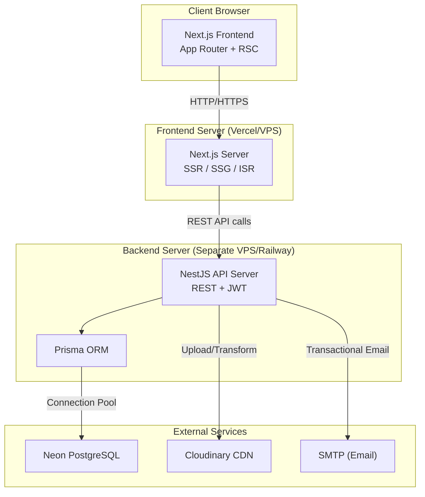
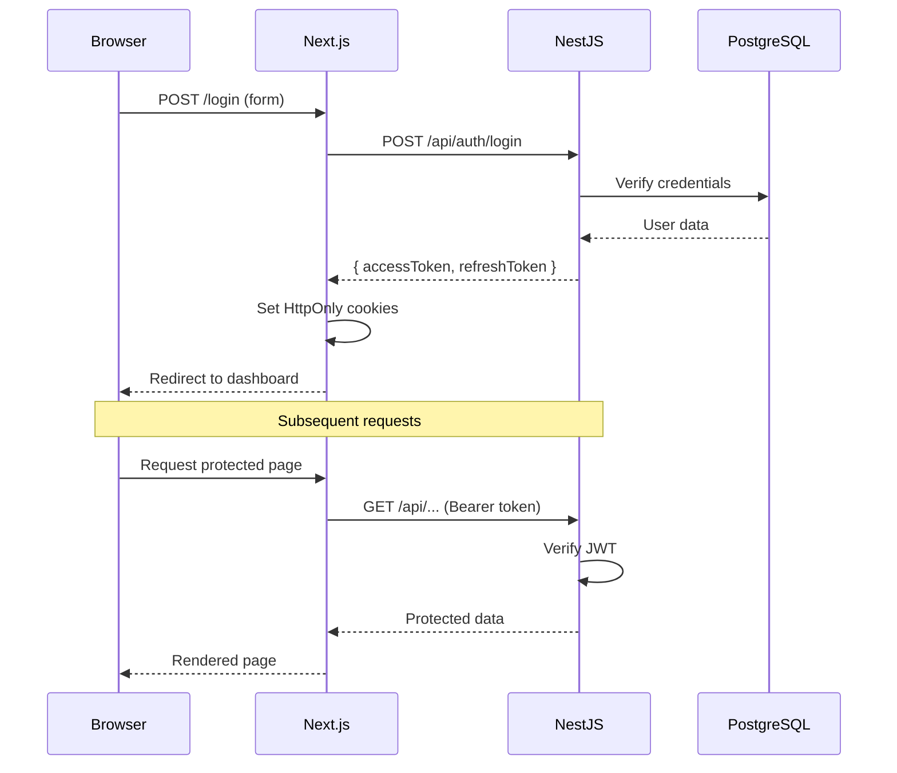

# Gumroad Clone — Kế Hoạch Kiến Trúc Production-Ready

## Phần 1: Kiến Trúc Tổng Thể & Audit Source Code

---

## 1. Audit Source Code Hiện Tại

### 1.1 Tổng quan dự án

| Thuộc tính | Giá trị |
|---|---|
| Framework | Vite + React 18 |
| Styling | Tailwind CSS 4.1 + Shadcn UI (Radix primitives) |
| Routing | React Router v7 (`createBrowserRouter`) |
| Font | Space Grotesk |
| Brand color | `#FF90E8` (Pink) |
| Data | Hardcoded mock data trong `data.ts` |
| UI Library | 48 Shadcn UI components (chưa sử dụng hết) |

### 1.2 Inventory Component

#### Pages (11 files)

| Page | File | Size | State | Loại trang (Next.js) |
|---|---|---|---|---|
| Discover (Homepage) | `Discover.tsx` | 184 LOC | `useState` (category filter) | SSR + CSR hybrid |
| Product Detail | `ProductDetail.tsx` | 315 LOC | `useParams` | SSR (dynamic) |
| Creator Profile | `CreatorProfile.tsx` | 227 LOC | `useParams` | SSR (dynamic) |
| Blog | `Blog.tsx` | 113 LOC | `useState` (category filter) | SSG + ISR |
| Blog Detail | `BlogDetail.tsx` | ~150 LOC | `useParams` | SSG |
| Login | `Login.tsx` | 187 LOC | `useState` (form state) | Client Component |
| Start Selling | `StartSelling.tsx` | 334 LOC | `useState` (form state) | SSG + Client |
| Pricing | `Pricing.tsx` | 372 LOC | `useState` (FAQ accordion) | SSG |
| Features | `Features.tsx` | 354 LOC | Stateless | SSG |
| About | `About.tsx` | 287 LOC | Stateless | SSG |
| Jobs | `Jobs.tsx` | ~250 LOC | Stateless | SSG + ISR |

#### Shared Components (6 files)

| Component | Tái sử dụng? | Cần refactor? | Server/Client |
|---|---|---|---|
| `Header.tsx` | ✅ Giữ nguyên | Đổi `Link` → Next.js `Link`, thêm auth state | Client (sticky, active state) |
| `Footer.tsx` | ✅ Giữ nguyên | Đổi `Link` → Next.js `Link` | Server Component |
| `ProductCard.tsx` | ✅ Giữ nguyên | Đổi `Link`, dùng `next/image` | Server Component |
| `CreatorCard.tsx` | ✅ Giữ nguyên | Đổi `Link`, dùng `next/image` | Server Component |
| `BlogCard.tsx` | ✅ Giữ nguyên | Đổi `Link`, dùng `next/image` | Server Component |
| `SearchBar.tsx` | ✅ Giữ nguyên | Thêm API integration | Client Component |

#### Figma Components (1 file)

| Component | Giữ? | Ghi chú |
|---|---|---|
| `ImageWithFallback.tsx` | ✅ | Chuyển sang dùng `next/image` fallback pattern |

#### Shadcn UI Components (48 files)

> **Quyết định:** Giữ nguyên toàn bộ 48 Shadcn components. Khi init Next.js project sẽ dùng `npx shadcn@latest init` và cài lại các component cần thiết. Shadcn CLI tương thích Next.js App Router natively.

### 1.3 Design System Tokens

```
Brand Pink:    #FF90E8
Background:    #FFFFFF, #FFF7EE (warm), #000000 (dark sections)
Border:        2px solid black (neo-brutalism style)
Shadow:        box-shadow: 4px 4px 0 0 #000 / 6px 6px 0 0 #000
Border radius: rounded-2xl, rounded-3xl, rounded-full
Font:          Space Grotesk, sans-serif
Font tracking: -0.02em ~ -0.03em (headings)
```

### 1.4 Các Pattern Đáng Chú Ý

- **Neo-brutalism design**: `border-2 border-black`, `hover:shadow-[6px_6px_0_0_#000]`
- **Font inline style**: Mọi element đều có `style={{ fontFamily: 'Space Grotesk' }}` → Cần refactor thành global font config
- **Mock data pattern**: Tất cả data hardcoded trong `data.ts` → Chuyển sang API calls
- **No authentication**: Login page chỉ là UI mock với `setTimeout`
- **No SEO**: SPA thuần túy, không có metadata, không crawlable

---

## 2. Kiến Trúc Tổng Thể



### 2.1 Tại sao tách Frontend & Backend riêng?

| Lý do | Giải thích |
|---|---|
| **Independent scaling** | Frontend (static + edge) scale khác backend (CPU-bound) |
| **Team separation** | Frontend team và Backend team deploy độc lập |
| **Technology flexibility** | Có thể swap backend mà không ảnh hưởng frontend |
| **Security boundary** | Database credentials chỉ tồn tại ở backend server |
| **Learning purpose** | Hiểu rõ contract API giữa hai hệ thống |

### 2.2 Communication Flow

```
Browser → Next.js Server (RSC) → NestJS API → PostgreSQL
Browser → Next.js Client (CSR) → NestJS API → PostgreSQL
Browser → Cloudinary (direct image load via CDN URL)
```

### 2.3 Authentication Flow



---

## 3. Module Map

### 3.1 Public Modules

| Module | Chức năng | Data Source |
|---|---|---|
| Homepage | Hero + trending products + featured creators | `GET /products?trending=true`, `GET /creators?featured=true` |
| Discover | Browse + filter + search products | `GET /products?category=X&search=Q&page=N` |
| Product Detail | Full product view + purchase CTA | `GET /products/:slug` |
| Creator Profile | Creator bio + their products | `GET /creators/:handle` |
| Blog | Blog listing + categories | `GET /blog-posts?category=X` |
| Blog Detail | Full blog article | `GET /blog-posts/:slug` |
| Search | Full-text product search | `GET /search?q=X` |

### 3.2 Auth Modules

| Module | Chức năng | API |
|---|---|---|
| Register | Create account | `POST /auth/register` |
| Login | Email/password login | `POST /auth/login` |
| Forgot Password | Request reset email | `POST /auth/forgot-password` |
| Reset Password | Set new password | `POST /auth/reset-password` |

### 3.3 Seller Dashboard Modules

| Module | Chức năng | API |
|---|---|---|
| Product Management | CRUD products | `/seller/products` |
| Upload Digital Product | File + thumbnail upload | `/seller/products` + Cloudinary |
| Analytics | Views, sales, conversion | `/seller/analytics` |
| Revenue Dashboard | Income charts + payouts | `/seller/revenue` |
| Order Management | View/manage orders | `/seller/orders` |

### 3.4 Customer Modules

| Module | Chức năng | API |
|---|---|---|
| Purchase History | Past orders | `/customer/orders` |
| Downloads | Download purchased files | `/customer/downloads` |
| Wishlist | Save products | `/customer/wishlist` |

### 3.5 Admin Modules

| Module | Chức năng | API |
|---|---|---|
| User Management | CRUD users, roles | `/admin/users` |
| Product Moderation | Approve/reject products | `/admin/products` |
| Analytics | Platform-wide stats | `/admin/analytics` |
